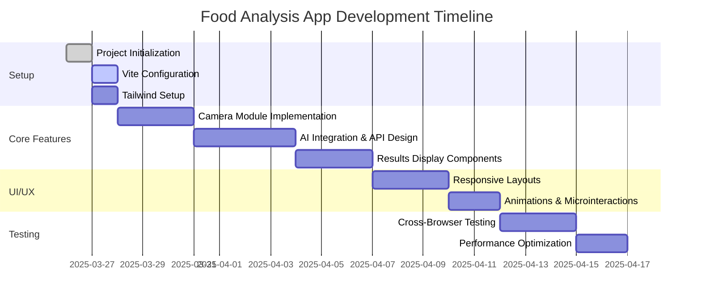

# Food Analysis App Project Plan

## Technical Stack
- **Frontend**: React.js
- **Build Tool**: Vite
- **Styling**: Tailwind CSS
- **State Management**: React Hooks
- **Routing**: React Router
- **AI Integration**: OpenAI Vision API (primary option)

## Project Structure
```
food-analysis-app/
│
├── public/
│   └── index.html
│
├── src/
│   ├── components/
│   │   ├── CameraCapture.jsx
│   │   ├── FoodDetails.jsx
│   │   ├── HealthImpactBadge.jsx
│   │   ├── IngredientList.jsx
│   │   └── CameraInterface.jsx
│   │
│   ├── pages/
│   │   ├── HomePage.jsx
│   │   ├── AnalysisPage.jsx
│   │   └── HistoryPage.jsx
│   │
│   ├── services/
│   │   ├── aiAnalysisService.js
│   │   └── storageService.js
│   │
│   ├── utils/
│   │   ├── imageProcessing.js
│   │   └── healthScoring.js
│   │
│   ├── App.jsx
│   └── main.jsx
│
├── tailwind.config.js
├── vite.config.js
└── package.json
```

## Implementation Timeline


## Key Milestones
1. **MVP Completion** - 2025-04-07
   - Basic camera functionality
   - AI integration working
   - Core analysis display

2. **UI Polish Complete** - 2025-04-12
   - All animations implemented
   - Responsive layouts finalized
   - Accessibility improvements

## Risk Management
| Risk Area | Probability | Impact | Mitigation Strategy |
|-----------|------------|--------|---------------------|
| AI Accuracy | Medium | High | Implement manual override option |
| Camera Performance | High | Medium | Fallback to file upload |
| API Rate Limits | Low | High | Implement client-side caching |

## Quality Assurance
- Automated unit testing for core components
- Manual testing on 5+ mobile devices
- Performance benchmarking
- Accessibility audits